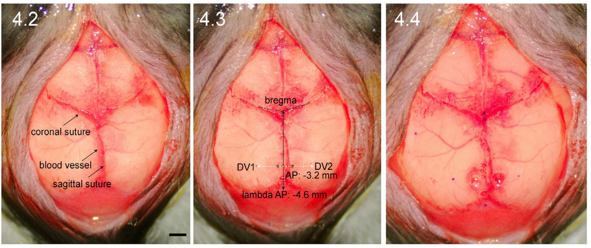

```{r setup, include=FALSE}
options(htmltools.dir.version = FALSE)
```

<center>

# Week 3 - Pharmacology in Neuroscience 

### Jennet Baumbach

### September 22nd 2023


---

# Historical Perspective 

--

**Golgi** and **Ramon y Cajal** (late 1800's)

--

- Golgi developed "the black stain", now known as Golgi-Cox staining

--

- Golgi's staining method was instrumental in characterizing different neuronal subtypes

--

.pull-left[

]

--

.pull-right[

]

---

# Historical Perspective 

**Golgi** and **Ramon y Cajal** (late 1800's)

- Golgi developed "the black stain", now known as Golgi-Cox staining

--

.pull-left[


]

.pull-right[

]

--

.footnote[[Golgi stain protocol](https://www.ihcworld.com/_protocols/special_stains/golgi.htm)]

---

# Historical Perspective 

**Golgi** and **Ramon y Cajal** (late 1800's)

- Golgi developed "the black stain", now known as Golgi-Cox staining

.footnote[[Golgi stain protocol](https://www.ihcworld.com/_protocols/special_stains/golgi.htm)]

.pull-left[

]

--

.pull-right[

- *Sparse* staining of entire neurons

- Mechanism that support stain uptake remain unknown


]

---

# Historical Perspective 

--

**Otto Loewi** was a German physician and pharmacologist

--

- Showed evidence for chemical neurotransmission in 1921 using frog heart with the vagus nerve attached (in preparation - i.e. still beating)

--

<center>


</center>

--

- Termed the activating substance in the fluid "Vagustaff" a.k.a. acetylcholine

--

.footnote[[Otto Loewi (1873–1961): Dreamer and Nobel laureate](https://www.ncbi.nlm.nih.gov/pmc/articles/PMC4291908/)]

---

# Basis of Neuronal Transmission

--

### Quick review of neuronal anatomy 

--

<center>


---

# Basis of Neuronal Transmission

--

### The Electro-Chemical Synapse

--

**Electrical** signals occur within neurons 

--

<center>


</center>

--

Within a neuron, electrical signals are summated at the axon hillock, and transmitted down the axon

---

# Basis of Neuronal Transmission

### The Electro-Chemical Synapse

**Electrical** signals occur within neurons 

--

- **Myelin** increases the speed and retention of electrical signals.

--

<center>


---

# Basis of Neuronal Transmission 

### The Electro-Chemical Synapse

--

**Chemical** transmission occurs between neurons

--

.pull-left[
]

--

.pull-right[
1. AP arrives at terminals of pre-synaptic neuron
2. Local depolarization facilitates ca2+ influx at the axon terminal of the pre-synaptic neuron
3. Calcium influx facilitates movement of synaptic vesicles towards the membrane. 
4. Synaptic vesicles "dump" their contents into the synapse via exocytosis
5. NT molecules float freely around the synapse
]

---

# Basis of Neuronal Transmission 

### The Electro-Chemical Synapse

**Chemical** transmission occurs between neurons

--

<center>


</center>

--

- Bind (and unbind) to post-synaptic receptors ; Get "cleaned up" by transporter molecules ; Sometimes diffuse out of the synapse (e.g. Dopamine)

---

# Neurotransmitters and Receptors 

--

### Classification of a neurotransmitter

--

1. Synthesized by pre-synaptic neurons

--

2. Stored in synaptic vesicles

--

3. **Action-potential-dependent release** (depolarization, calcium influx)

--

4. Released from axon terminals

--

5. Binds to receptors on the post-synaptic membrane

--

6. Produces a response in the post-synaptic cell


--

.footnote[[NiH: What defines a neurotransmitter?](https://www.ncbi.nlm.nih.gov/books/NBK10957/)]

---

# Basis of Neuronal Transmission 

--

### Post synaptic receptors

--

1. Ion channels (the *ions carry the charge* in solution)

--

2. Metabotrophic receptors to initiate 2nd messager cascades

---

# Key Neurotransmitter systems

--

### Glutamate

--

- Two key receptor types: AMPA, NMDA 

--

<center> 


---

# Key Neurotransmitter systems 

--

###  Gamma-aminobutyric acid (GABA)

--

.pull-left[

- GABA receptor is a Cl- channel where 5 protein subunits surround a central pore

]

--

.pull-right[

- Simultaneous binding of 2 GABA molecules facilitates a conformational change
that allows ions to enter

- *How long* the channel remains open for (or *how often it opens*) after GABA binding or can be regulated by **alosteric modulators**
]

---

# Pharmacological modulation of NT systems

--

### Types of receptor modulation

--

- **Endogenous ligand**: The natural molecule that the body produces to bind to a given receptor. 

--

- **Agonist**: Mimics the action of the endogeneous ligand

--

- **Antagonist**: Blocks the binding site, but doesn't activate it

--

<center>


</center>

---

# Pharmacological modulation of NT systems

### Types of receptor modulation

--

- Agonists or antagonists can be **competitive** vs. **non-competitive**

--

Example: Opiate drugs (morphine, heroin etc.) are *agonists* to opioid receptors. 

--

- Naloxone is a *competitive antagonist* to block the effects of opioid overdose. 

--


---

# Pharmicokinetics

--

**Affinity**: the tendancy for a molecule to bind to its target receptor

--

**Efficacy**: the extent to which the drug is able to produce the endogenous effect at the target receptor. 

--

**Potency**: how much volume of drug is required to reach its maximal effect

--

.pull-left[


dose-response curves for a series of agonists that have the same efficacy, but differ in terms of their potency.

]


--

.pull-right[
- The most potent drug (Drug A) has the lowest EC50 value, and is approximately 20-30 fold more potent than Drug D.
]

---

# Pharmicokinetics

**Affinity**: the tendancy for a molecule to bind to its target receptor

**Efficacy**: the extent to which the drug is able to produce the endogenous effect at the target receptor. 

**Potency**: how much volume of drug is required to reach its maximal effect

--

.pull-left[


Dose-response relationships for four agonists that vary in efficacy

]

--

.pull-right[

- The drugs differ in terms of the maximum response they can produce at high concentrations that saturate all available receptor sites. 

- Drug A has a relative efficacy that is 2 times than Drug C, and ~100 times more than Drug D.
]

---

# Pharmicodynamics

--

#### How the drug moves through the system to reach its target receptors 

--

Example: altering the *pharmicodynamics* of an opioid drug can impact its potency: 

--

<center> 


</center>

--

Heroin is estimated to be 2x "as strong" as morphine (increased potentcy via altered pharmicodynamics)

---

# Routes of administration

--

### Systemic - delivered to general circulation

.pull-left[

<center> 

**Sub-cutaneous (s.c.)**

]

--

.pull-right[

<center>

**Intra-peritoneal**
]

--

<center> 


</center>

--

.pull-left[

- needle penetrates skin only
- quicker & easier

]

--

.pull-right[

- needle penetrates muscle wall
- flipping over is distressing
- potential to damage organs

]

---

# Routes of administration

--

### Stereotaxic - delivered directly to the brain

--

.pull-left[


]

--

.pull-right[


]

---

# Routes of administration

### Stereotaxic - delivered directly to the brain

--

A 3-dimensional Cartesian co-ordinate system is used to precisely target a specific brain region

--

<center>


---

# Routes of administration

### Stereotaxic - delivered directly to the brain

--

<center>


---

# Routes of administration

### Stereotaxic - delivered directly to the brain

--

.pull-left[


]

--

.pull-right[

]

--

The stereotaxic method is designed for reproduceability.

---

# Routes of administration

--

### Stereotaxic - delivered directly to the brain

--

.pull-left[

]

--

.pull-right[

- **Bregma**: A visible point on the skull that is used as the "zero" point for determining brain coordinates. 

- **Lambda**: Can be used to check skull angle (should be 0) or to adjust co-ordinates (e.g. for juveniles)

]

--

.footnote[[Benskey et al. 2016](https://pubmed.ncbi.nlm.nih.gov/26611588/)]

---

# Routes of administration

### Stereotaxic - delivered directly to the brain

--

```{r, echo=FALSE,out.width="75%",fig.align='center'}

```

--

**Bregma** Is used as the 0,0 point (AP,ML) for stereotaxic surgery. 

---

# Routes of administration

### Stereotaxic - delivered directly to the brain

--

```{r, echo=FALSE,out.width="65%",fig.align='center'}
knitr::include_graphics("ratlas.png")
```

--

.footnote[[Rat and mouse brain in stereotaxic co-ordinates](http://labs.gaidi.ca/rat-brain-atlas/?ml=2&ap=-4.5&dv=-2.7)]

---

# Routes of administration

### Stereotaxic - delivered directly to the brain

--

.pull-left[

<center>

<b>One-time delivery</b>


</center>

- e.g. Viruses (to alter gene expression; more on this another week)

]

--

.pull-right[

<center>

<b>Cannulation - Permanent access</b>


</center>


- a "tube" is implanted to give access to the target brain region

]

---

# Routes of administration

### Stereotaxic - delivered directly to the brain

--

.pull-left[

**Advantages**: 

- local (region-specific) delivery
- icv infusion
- bypasses the BBB
- much lower drug volumes needed than with systemic administration
- quicker and more consistent drug onset
- no loss to first-pass metabolism
]

--

.pull-right[

**Disadvantages**:

- Labor intensive to do surgeries
- Recovery might require single-housing
- Unknown consequences of iso exposure, canula implantation etc. on behaviour, necessitating many control groups

]

---

# Issues and Limitations with Pharmacology in Neuroscience

--

### Dirty drugs 

--

- System-specific, off-modality effects

--

- System non-specific (off-target) effects

--

- genetic manipulations are 'cleaner' 

---

<center> 
# Questions? :) 


